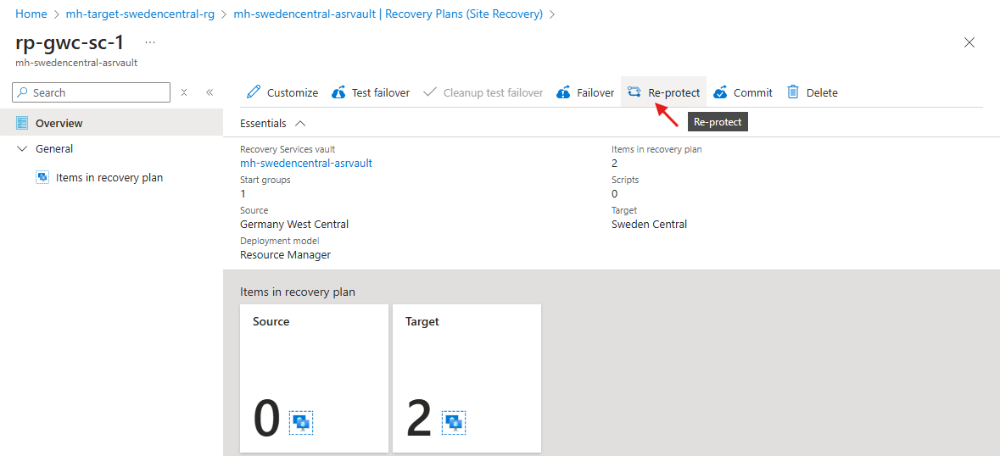
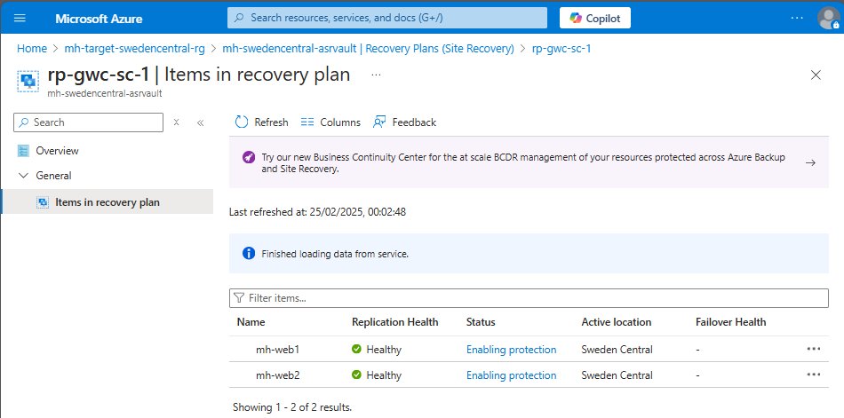
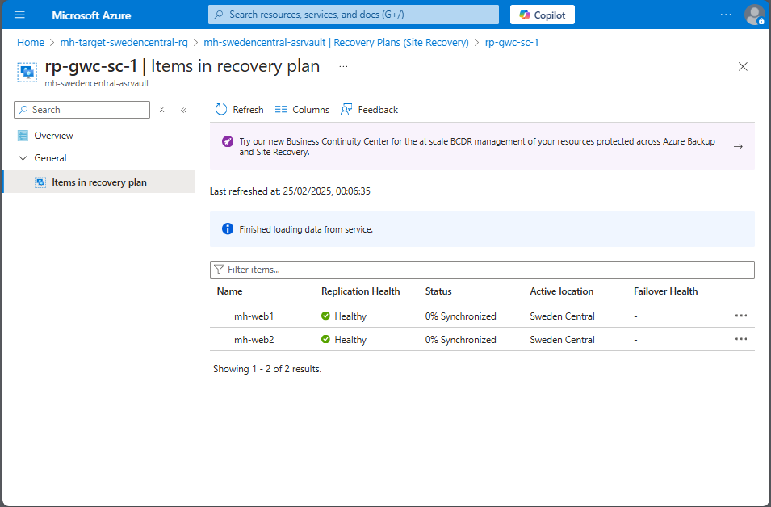
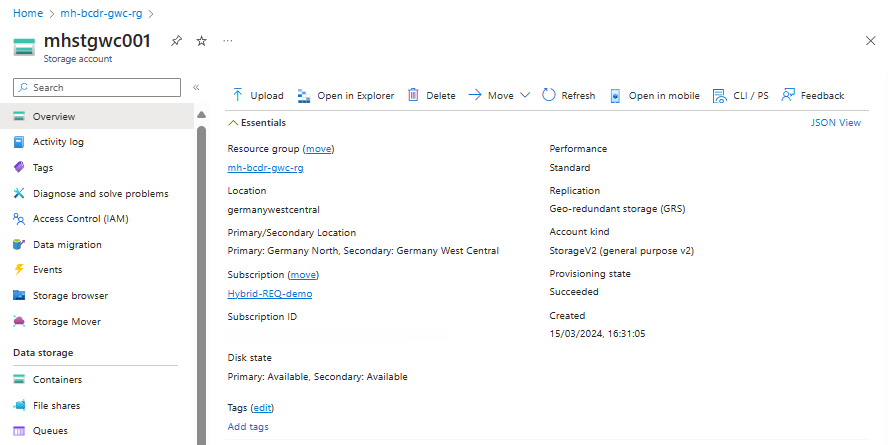
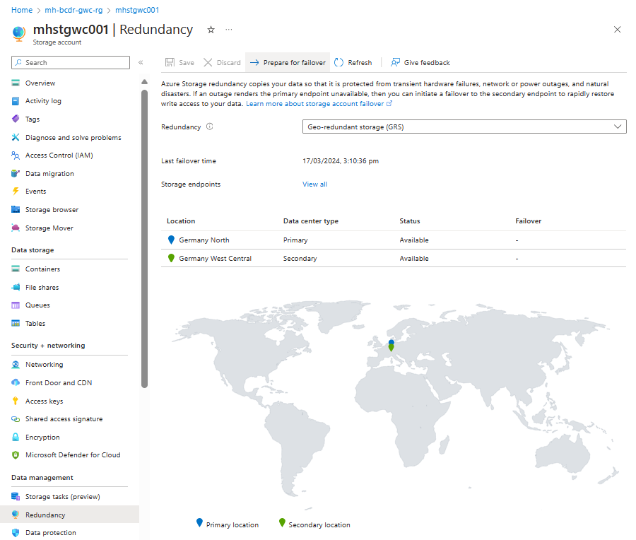
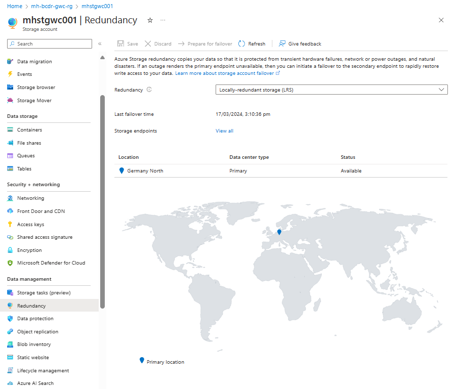
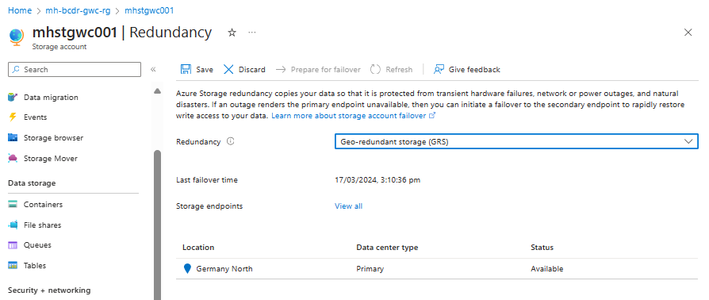
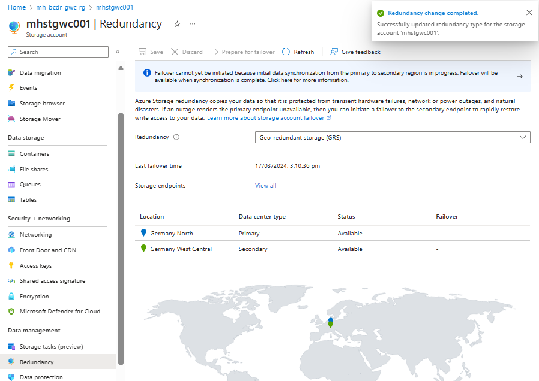
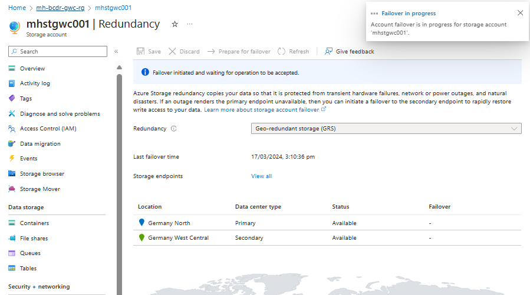
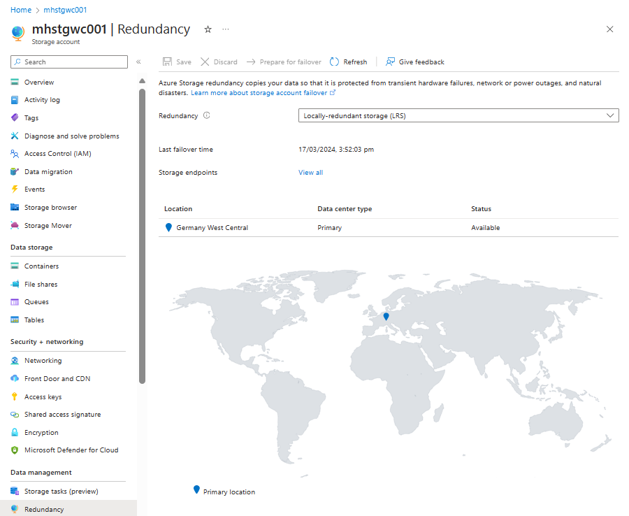

# Walkthrough Challenge 5 - Failback to the primary region (France Central)

⏰ Duration: 50 minutes

📋  [Challenge 5 Instructions](../../challenges/05_challenge.md)

## Prerequisites

Please ensure that you successfully passed [challenge 4](../../Readme.md#challenge-4) before continuing with this challenge.

In this challenge, you will have failback again the Web Application VM's from Sweden central to France Central. The storage account should be failed back to France Central as well.

### Actions
* Task 1: Failback the Web Application VM's from Sweden Central to France Central region (Source environment) and monitor the progress.
* Task 2: Failback Storage Account to France Central.

# Solution

## Disaster Recovery for Azure Virtual Machines

## Task 1: Failback the VM's from Sweden to France region (Source environment) and monitor the progress

### Ensure the VM's in the Recovery Plan has been  Re-protected (this is done in challenge 3).
The Reprotect changes the sync back to source destination.

* [Azure Site Recovery - How to reprotect](https://learn.microsoft.com/en-us/azure/site-recovery/azure-to-azure-how-to-reprotect)

### Run the failback for the VM from Sweden Central Region to France Central
You can't fail back the VM until the replication has completed, and synchronization is 100% completed. The synchronization process can take several minutes to complete.
After the Synchronization completes, select **Failover**.

Check the Virtual machine list. Web01 and Web02 is running again in the France Central region.

## Disaster Recovery for Azure Storage Account

## Task 3: Failback Storage Account to France Central

### Navigate to the **Azure Storage Account**

### Open the tab **Redundancy**:

### If not configured, choose Geo-redundant storage (GRS) as redundancy option. This will enable cross-replication of your storage account with the paired region France Central. 

### You can see now France Central as the Secondary Region of the Storage Account:

## Perform a failover test for the storage account to validate the disaster recovery setup.

### Run the test failover from France South to the France Central Region

### Failover Completed

**You successfully completed challenge 5!** 🚀🚀🚀

### Learning resources
* [Azure Site Recovery - How to reprotect](https://learn.microsoft.com/en-us/azure/site-recovery/azure-to-azure-how-to-reprotect)
* [Azure Site Recovery - Failback](https://learn.microsoft.com/en-us/azure/site-recovery/azure-to-azure-tutorial-failback)
* [Azure Site Recovery - Enable Replication](https://learn.microsoft.com/en-us/azure/site-recovery/azure-to-azure-tutorial-enable-replication)
* [Testing for disaster recovery](https://learn.microsoft.com/en-us/azure/site-recovery/site-recovery-test-failover-to-azure)

[➡️ Next Challenge 6 Instructions](../../challenges/06_challenge.md)